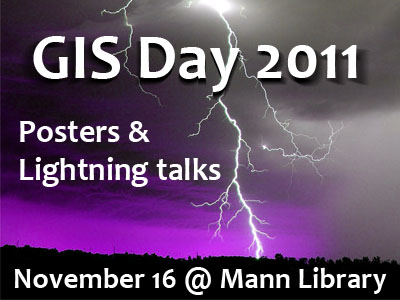

# GIS Day 2011

Wednesday, November 16, 2011 \
Mann Library 102

GIS Day is held each November during Geography Awareness Week, with events in more than 80 countries. Local events in Ithaca are organized by members of SynerGIS, a group of GIS professionals, managers, and students from Cornell, Tompkins County, and the surrounding area.

## Schedule of Events

- 10:30 to 12:00 : Geocaching (start at Mann Library Lobby)
- 12:00 to 2:45 : Open house and posters (Mann 102)
- 12:30 : Lightning Talks, wave one (Mann 102)
- 1:30 : Lightning Talks, wave two (Mann 102)

### Lightning Talks

GIS Day 2011 will feature two series of short, 5-minute presentations given by folks from across several Cornell departments and local governments, each sharing a bit of what they are doing with Geographic Information Systems (GIS).

#### Wave One (starting at 12:30pm)

- Joe Francis – [Mapping Uncertainty in the American Community Survey](slides/Francis.pdf)
- Sue Hoskins – [Getting Our Feet Wet: 4-H Geospatial Sciences and National Wildlife Refuges](slides/Hoskins.pdf)
- Steve Smith – [ArcGIS Mosaics](slides/Smith.pdf)
- Jeremy Cusker – [Research Data Management Service Group](slides/Cusker.pdf)
- Jan Vink – [Census 2010 Atlas](slides/Vink.pdf)
- Kelly Christian – [Educating the Educator: GIS for Integrative Learning](slides/Christian.pdf)
- Rowena Lohman – [The Next Generation of NASA Missions](slides/Lohman.pdf)
- Susan Nixson – [NYSGIS Association, Southern Tier Region Update](slides/Nixson.pdf)

(break)

#### Wave Two (starting at 1:30pm)

- Keith Jenkins – [Finding Geospatial Data Sources](slides/Jenkins.pdf)
- David Siddhartha Patel – [Islam and the spatial ordering of urban violence in Iraq](slides/Patel.pdf)
- Zack Nelson – [Geocoding GIAC Participants](slides/Nelson.pdf)
- Boris Michev – [A Newborn Library and the World Beyond: Using GIS to Map Some of the Most Crucial Events of 1961](slides/Michev.pdf)
- Resya Kania – [GIS for Accountability Reporting on the Social Security Program in Indonesia](slides/Kania.pdf)
- Chris Marx – YardMap
- Ruth Aslanis – [GIS in Redistricting](slides/Aslanis.pdf)
- Stephan Schmidt – Community Viz

### Posters

Before, between, and after the lightning talks, an open house provided an opportunity for presenters and audience members to mix and mingle, viewing posters, and seeking out that person who gave that great lightning talk earlier, to ask questions and learn more.

Confirmed posters:

- Amy Liu – Modeling Bobcat Habitat Suitability in the Adirondacks
- Boris Michev – Unusual Maps: Exploring Different Geographies
- Leslie Ladd Allee – The Lost Ladybug Project
- Sarah Wright – The Research Data Management Services Group
- Steve DeGloria – Environmental Vulnerability, Assessment, and Monitoring of Grazing Systems under Indexed-based Livestock Insurance Programs in East Africa
- Steve DeGloria and Keith Jenkins – Geospatial Science and Technology Instruction at Cornell
- Susan Hoskins – Getting Our Feet Wet: 4-H Geospatial Sciences and National Wildlife Refuges
